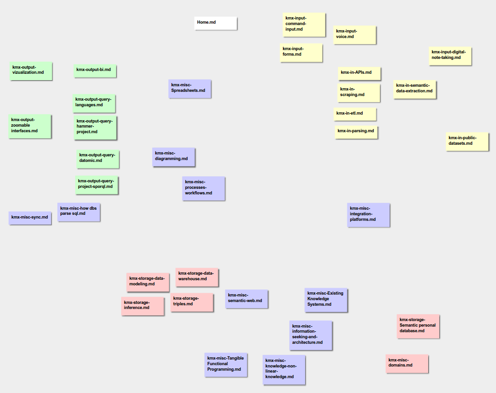

# stickies

Sticky notes demo app, supports dragging around and markdown content.




## Development Mode

Install dependencies:
```
lein deps
```

Run app in dev mode:
```
lein dev
```

### Run tests:

```
lein clean
lein doo phantom test once
```

The above command assumes that you have [phantomjs](https://www.npmjs.com/package/phantomjs) installed. However, please note that [doo](https://github.com/bensu/doo) can be configured to run cljs.test in many other JS environments (chrome, ie, safari, opera, slimer, node, rhino, or nashorn).

## Production Build


To compile clojurescript and less styles:

```
lein build
```
